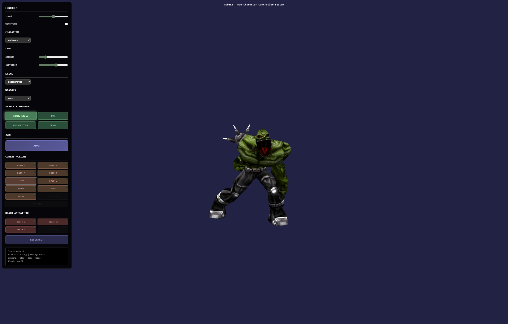

# WebGL2 MD2 Character Controller — all‑GPU morphing, crunchy Quake vibes

Fast, fun, and crispy. This project renders MD2 characters in WebGL2 and runs all vertex morphing on the GPU. We pack per‑frame vertex positions and normals into textures and sample them directly in the vertex shader, then blend between animations (base/run/crouch, one‑shots, jump, death) with smooth, configurable transitions.

Big thanks to the three.js ecosystem and community models that made this possible.

- Inspired by the official three.js MD2 example: webgl_morphtargets_md2
- Huge thanks to Jérôme Etienne’s threex.md2character for the original Ratamahatta integration:
  https://github.com/jeromeetienne/threex.md2character
- Ratamahatta model by Brian Collins (Quake 2 era) — legendary

Have fun, and may your jump landings always feel right.

---

## Live Demo

- Try it here: https://md2-seven.vercel.app
- Screenshot:

---

## Highlights

- 100% GPU morphing (no CPU skinning)
- Dual‑layer animation blending (Base ↔ One‑shot / Jump / Death)
- No‑pop landing/exit selection (picks the correct base cycle at the return frame)
- Stance‑aware controls (standing/crouching + idle/move)
- Camera‑relative WASD that updates live as you orbit
- Combat one‑shots and death animations with seamless returns
- Weapons and skins per character
- Wireframe toggle, runtime light controls, orbit camera
- WASD + Spacebar, and UI buttons

---

## How the GPU morphing works

MD2 stores a sequence of frames per animation. We:

1) Parse MD2 and expand the indexed mesh to a linear stream of vertices (once).  
2) Upload ALL frames’ vertex positions to a 2D RGBA32F texture (posTex) — one row per frame.  
3) Upload ALL frames’ normals to another 2D RGBA32F texture (nrmTex) — same layout.  
4) In the vertex shader, for each vertex:
   - Sample the current base animation frame pair (frame0A, frame1A), interpolate by uFrameFracA.
   - Sample the current secondary animation frame pair (frame0B, frame1B), interpolate by uFrameFracB.
   - Blend A and B by uAnimBlend.
5) The fragment shader does simple textured lighting — the magic is in the VS.

Key uniforms in the vertex shader:

- uPosTex, uNrmTex: texture samplers  
- uFrame0A, uFrame1A, uFrameFracA: base animation frames  
- uFrame0B, uFrame1B, uFrameFracB: secondary animation frames  
- uAnimBlend: blend amount between base and secondary  
- uNumFrames, uTexWidth: addressing info for sampling specific vertex rows/columns

This lets us:

- Interpolate within an animation (frame n to n+1)
- Cross‑fade between animations (base ↔ jump/one‑shot/death)
- Keep the CPU free from per‑frame vertex math

---

## Controls

- W/A/S/D: Move relative to camera (updates target yaw in real-time)
- C: Toggle crouch/stand (when not jumping or dead)
- Space: Jump (landing anim adapts to input at the landing frame)
- UI: Switch skins, weapons, animations (one‑shots, deaths), stance, wireframe, speed, lights

---

## Add a new MD2 character

Bring your own MD2 into the party.

1) Drop assets  
- Put your MD2 and textures in a folder (e.g. `public/models/yourCharacter/`).  
- Ensure your main model MD2 is present.  
- Optional: weapon MD2s and their textures.  
- Optional: multiple skins.

2) Register the character in `src/characterLoader.js`  
- Add an entry to `initializeCharacters()` with:
  - name: 'yourCharacter'
  - mainModel: 'yourCharacter/yourCharacter.md2'
  - weapons: list of `{ name, model, texture }` (optional)
  - skins: list of `{ name, texture }`

Example:
&&&js
{
  name: 'myhero',
  mainModel: 'myhero/myhero.md2',
  weapons: [
    { name: 'w_sword', model: 'myhero/w_sword.md2', texture: 'myhero/skins/w_sword.png' }
  ],
  skins: [
    { name: 'default', texture: 'myhero/skins/default.png' },
    { name: 'desert', texture: 'myhero/skins/desert.png' }
  ]
}
&&&

3) Map animations (if needed)  
- `src/md2.js` contains `ANIMS` for the animations used by the UI and controller.  
- If your MD2 uses different frame ranges or names, update `ANIMS` accordingly.  
- The controller expects:
  - stand, run, jump, attack, pain1/2/3, flip, salute, taunt, wave, point
  - crouch: crstnd, crwalk, crattack, crpain
  - deaths: death1/2/3 and crdeath
- If your model differs, either:
  - Remap `ANIMS` ranges to your frames, or
  - Adjust `AnimationController` to your naming scheme.

4) Scale/offset adjustments (optional)  
- If your model appears too large/small, tweak `MODEL_SCALE` in `src/main.js`.  
- If it faces a different axis, you can alter the orientation or the initial yaw.

---

## Jump landing, the “no‑pop” approach

When you press Space:
- We blend into the jump animation.
- At the landing frame (configurable), we decide which base cycle to fade to (stand/run/crwalk) based on current input/stance at that exact moment.
- We then blend out of jump into that chosen base. This avoids that awkward pop where you briefly see an outdated base anim before switching to the correct one.

You can adjust when landing starts via:
&&&js
animationController.setJumpExitTiming(0..1)
// 1.0 means at the last frame of the jump
// 0.8 would begin the landing blend a bit earlier
&&&

---

## Local development

This project uses Vite.

- Install: `npm install`  
- Dev server: `npm run dev` (open the printed local URL)  
- Build: `npm run build`  
- Preview production build: `npm run preview`

Note: Paths assume the app is served from the repository root with `/src` and your model folders readable.

---

## Assets and licensing (read carefully)

This repository separates code (MIT) from third‑party model licensing. Here’s what’s included vs optional:

### Included
- Ratamahatta (by Brian "EvilBastard" Collins)
  - Folder includes the original `ratamahatta.txt` (please keep it).
  - Terms (from the readme): “Feel free to edit my model… This model is not to be distributed as part of any commercial product.”  
  - We include it here for non‑commercial demonstration with attribution. Do not use it in commercial products. If you fork this repo, keep the readme alongside the model and preserve attribution.

- Example model with a clear license
  - An additional MD2 with a permissive/clear license is included (see the model’s subfolder for its LICENSE).
  - You may use that model per its stated terms.

### Not included (user‑supplied)
- Ogro (by Magarnigal; skins by Ogro_Fix; additional skin by Deranged)
  - Licensing for redistribution is unclear. To stay compliant, we do not ship Ogro in this repo or the default build.
  - If you want to try Ogro locally, download from the three.js examples and place it in your local project (do not commit it):
    - https://github.com/mrdoob/three.js/tree/dev/examples/models/md2/ogro
  - Keep `Ogro.txt` in the same folder and do not use in commercial products unless you have permissions from the rights holders.
  - Suggested local paths (example):
    - `public/ogro/ogro.md2`
    - `public/ogro/weapon.md2`
    - `public/ogro/skins/...`
  - Add these paths to your `.gitignore` to avoid accidental commits.

If you’re unsure about any asset’s license, remove it and use a permissively licensed alternative (CC0/CC‑BY, MIT‑style) or your own content.

---

## Credits and thanks

- three.js team and contributors for the MD2 examples and the inspiration  
- Jérôme Etienne for threex.md2character and the Ratamahatta integration:  
  https://github.com/jeromeetienne/threex.md2character  
- Ratamahatta model by Brian Collins (via Quake 2 community)

If we missed anyone, please open an issue or PR and we’ll gladly correct and expand the credits.

---

## License

- Code in this repository is under MIT (see LICENSE).
- Third‑party models and textures are subject to their own licenses:
  - Ratamahatta: non‑commercial; attribution required (see `ratamahatta.txt`).
  - Example model: see LICENSE in its folder.
  - Ogro (optional, user‑supplied): not included; if you import locally, keep `Ogro.txt` and respect its terms.
- Quake and Quake II are registered trademarks of id Software.

Have fun, be kind, ship frames.